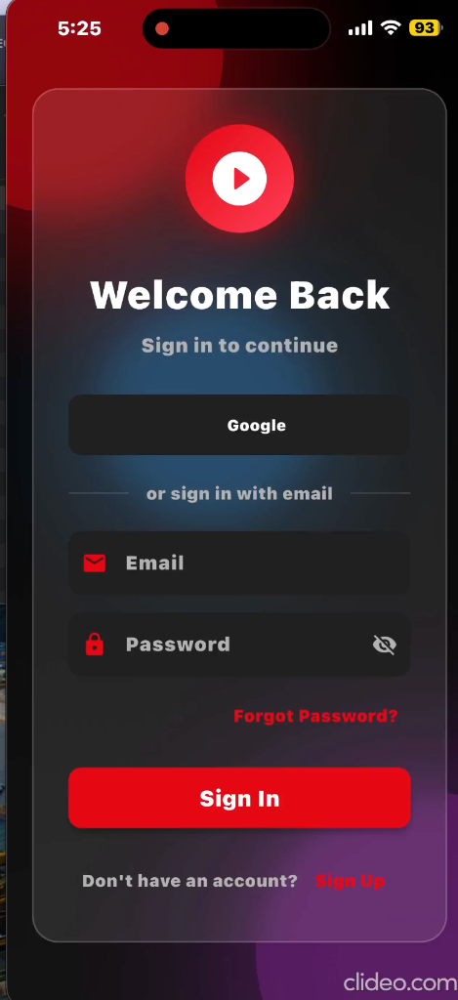
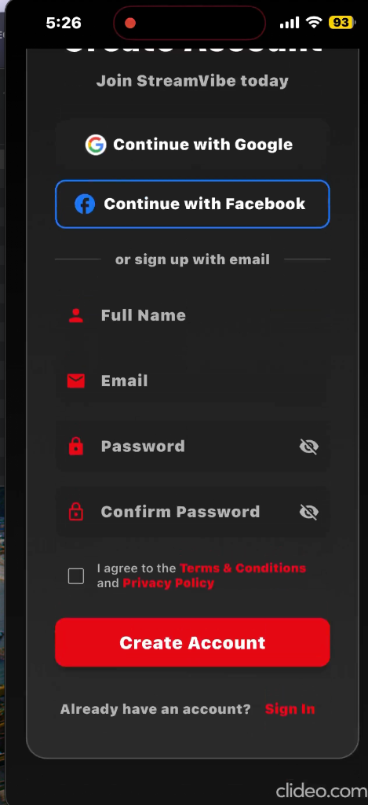
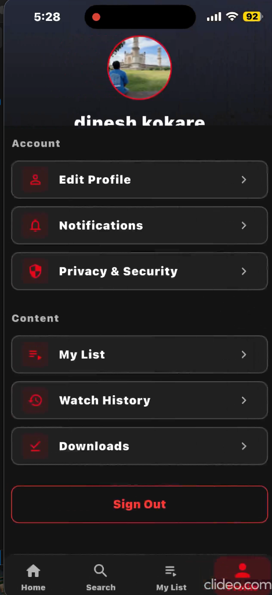
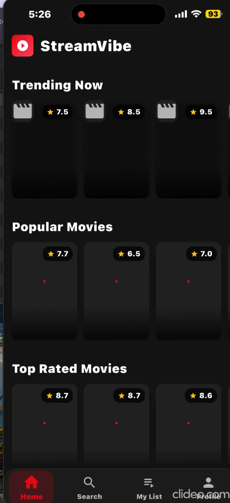
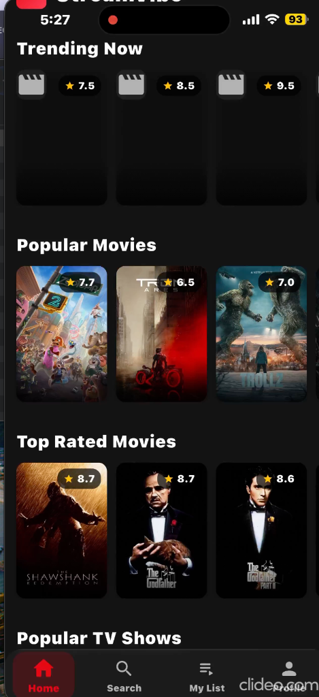
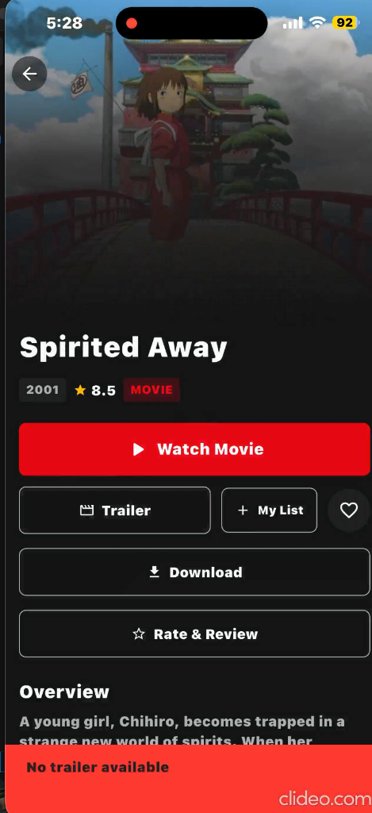

# 🎬 StreamVibe - Premium OTT Platform

<div align="center">


**A beautiful and feature-rich OTT (Over-The-Top) streaming platform built with Flutter**

Featuring real-time API integration, advanced animations, liquid glass UI, and a Netflix-inspired design

  [Features](#-features) 
• [Screenshots](#-screenshots)


https://github.com/user-attachments/assets/8936463c-b7ab-47a3-9519-c86cf99447a9


• [Installation](#-setup-instructions) 
• [Documentation](#-documentation)

</div>

---

## ✨ Features

### 🎬 Content & Streaming
- **Real-time API Integration** with TMDB (The Movie Database)
- **Trending, Popular & Top Rated** content sections
- **Smart Search** with instant results
- **Video Player** with HD playback and trailer previews
- **Cast to TV** support (Chromecast & AirPlay ready)
- **Offline Mode** with Smart Downloads support
- **Creator Studio** for uploading and managing short-form content

### 👤 User Experience
- **Firebase Authentication** (Email/Password, Google Sign-In)
- **Multi-Profile Support** for family accounts
- **Parental Controls** with PIN protection and age ratings
- **Watchlist & Favorites** management
- **Watch History** with "Continue Watching" functionality
- **Multi-Language Support** (12 Languages implemented)

### 🎮 Gamification & Engagement
- **Achievements System** with unlockable badges
- **Daily Challenges** to keep users engaged
- **XP & Leveling System** based on watch time
- **Streaks** for consecutive daily usage
- **Confetti Celebrations** for unlocking achievements

### 🤝 Social Features
- **Social Community Hub** for interacting with other users
- **Watch Parties** (Live prototype) to watch together
- **Comments & Discussions** on movies and shows
- **Friend System** to follow other users' activity

### 🧠 Smart Features
- **AI-Powered Recommendation Engine** (Personalized & Collaborative Filtering)
- **"Because You Watched"** suggestions
- **Similar Content Finder**
- **Smart Notifications** for new episodes and personalized picks

### 📊 Analytics & Monetization
- **Custom Analytics Dashboard** for user insights
- **AppsFlyer Integration** for marketing attribution
- **Subscription Plans** management UI

### 🎨 Design & Immersion
- **Netflix-Inspired Dark UI**
- **Liquid Glass Effects** & Premium Animations
- **Animated Splash Screen** with floating orbs
- **VR Theater Mode** for immersive viewing
- **Theme Customization** engine

## 📸 Screenshots

<div align="center">

### 🔐 Authentication & Profiles

<p float="left">
  
  
  
</p>

*Secure auth with multi-profile support and detailed user settings*

---

### 🏠 Home & Discovery

<p float="left">
  
  
</p>

*Rich content discovery with "Trending", "Popular", and "Recommended For You"*

---

### 🎬 Playback & Details

<p float="left">
  
  
</p>

*Immersive details page and full-featured video player*

</div>

## 🔧 Setup Instructions

### 1. Clone the Repository

```bash
cd /Users/dineshkokare/Documents/ott_streaming_app
```

### 2. Install Dependencies

```bash
flutter pub get
```

### 3. Configure API Keys

1. **Copy the environment template:**
   ```bash
   cp .env.example .env
   ```

2. **Update `.env` with your keys:**
   - **TMDB_API_KEY**: Get from [TMDB](https://www.themoviedb.org/)
   - **RAPID_API_KEY**: Get from [RapidAPI](https://rapidapi.com/gox-ai-gox-ai-default/api/ott-details) (optional for streaming sources)
   - **APPSFLYER_DEV_KEY**: Get from AppsFlyer (optional for analytics)

### 4. Run the App

```bash
flutter run
```

## 📱 App Structure

```
lib/
├── constants/         # API constants, colors, themes
├── models/            # Data models (Content, User, Achievement, etc.)
├── providers/         # State management (Auth, Content, Gamification, etc.)
├── screens/           # UI Screens (35+ screens implemented)
├── services/          # Backend services (API, Firebase, Recommendations)
├── widgets/           # Reusable UI components
└── main.dart          # Entry point
```

## 📚 Documentation

Detailed documentation is available in the project:

- **[FEATURES_OVERVIEW.md](FEATURES_OVERVIEW.md)**: Detailed breakdown of features
- **[ULTIMATE_FEATURES_STATUS.md](ULTIMATE_FEATURES_STATUS.md)**: Implementation status log
- **[ADVANCED_FEATURES_GUIDE.md](ADVANCED_FEATURES_GUIDE.md)**: Guide for advanced capabilities
- **[NOTIFICATIONS_FEATURE.md](NOTIFICATIONS_FEATURE.md)**: Notification system details
- **[SECURITY_IMPLEMENTATION_SUMMARY.md](SECURITY_IMPLEMENTATION_SUMMARY.md)**: Security protocols

## 🗺️ Roadmap & Status

- [x] **Core Streaming Platform** (Home, Search, Details, Player)
- [x] **User Management** (Auth, Profiles, Watchlist)
- [x] **Advanced UI** (Liquid Glass, Animations, Dark Mode)
- [x] **Localization** (12 Languages)
- [x] **Gamification** (Levels, Badges, Confetti)
- [x] **Social Features** (Community, Watch Party, Friends)
- [x] **Offline Support** (Downloads)
- [x] **Smart Features** (Recommendation Engine)
- [x] **Monetization & Analytics** (Subscriptions, AppsFlyer)

## 📊 Project Stats

- **Language**: Dart
- **Framework**: Flutter
- **State Management**: Provider
- **Screens**: 35+
- **Features**: 30+
- **Lines of Code**: 8000+

## 📄 License

This project is for educational purposes. Please ensure you comply with TMDB API terms of service.

## 👨‍💻 Author

**Dinesh Kokare**
- GitHub: [@dineshkokare](https://github.com/dineshkokare)

<div align="center">

**Built with ❤️ using Flutter**

</div>
